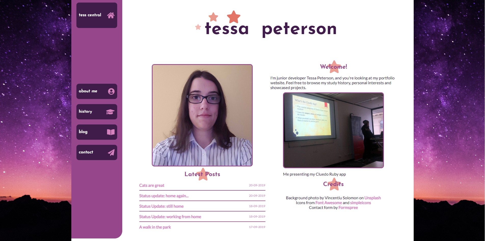
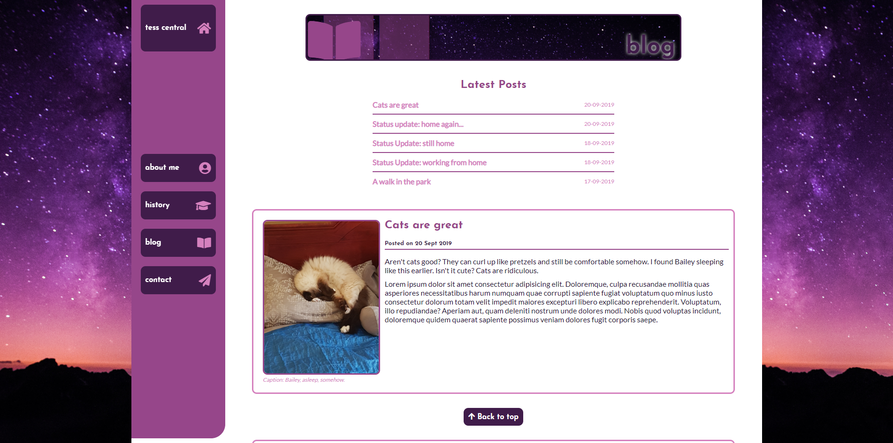
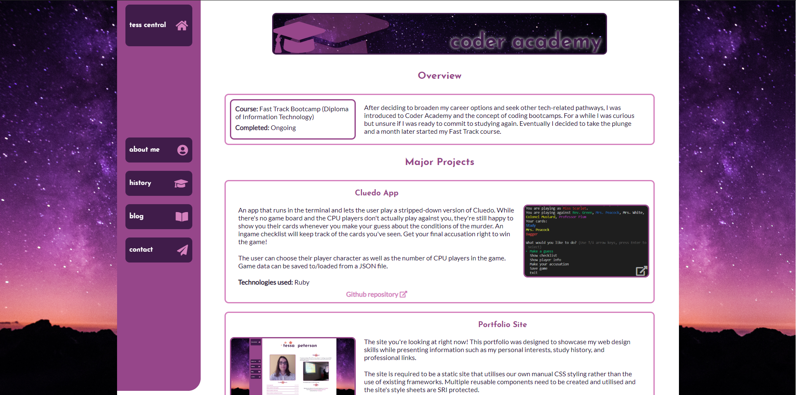

# T1A3 - Portfolio - Tessa Peterson

- [Site](https://techspeterson-portfolio.netlify.com/)
- [Github](https://github.com/techspeterson/portfolio-site)

## Purpose
This site is a personal portfolio website designed to practically demonstrate my web design skills and design sense in a static website, while also providing insight into my personal interests, professional skills and history, and showcasing my project portfolio.

## Features
This portfolio includes:
- A brief overview of me as a person, including my personal interests and my design inspirations
- My educational history and overviews of some of the projects I've worked on
- Multiple blog entries with images
- My professional contact links and an email contact form

## Sitemap

## Screenshots

## Target audience
This site is aimed at potential employers as a demonstration of the skills I can apply to the workplace, but also can serve as an introduction to me for anyone in the tech industry discovering my profile.

## Tech stack
- HTML5
- CSS3
- External resources such as Google Fonts, Font Awesome
- Deployed with Netlify via Github