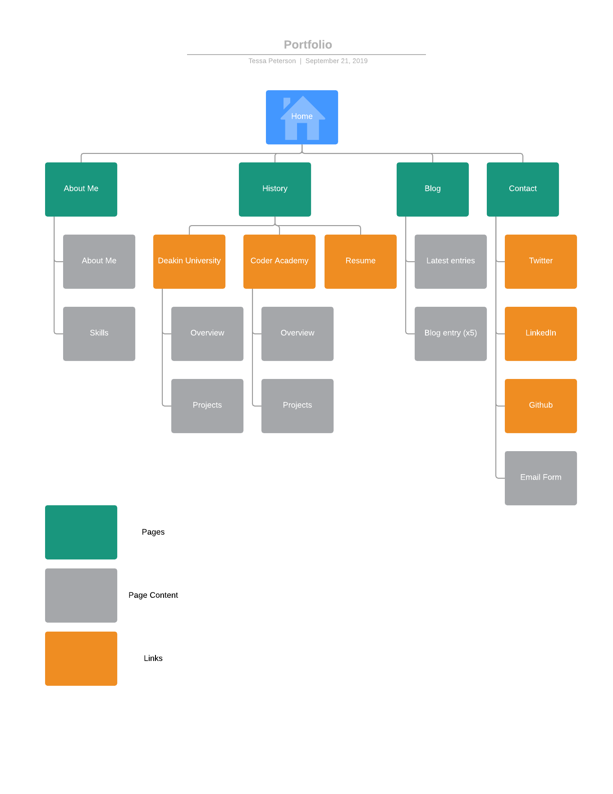

# T1A3 - Portfolio - Tessa Peterson

- **Site:** [https://techspeterson-portfolio.netlify.com/](https://techspeterson-portfolio.netlify.com/)
- **Github:** [https://github.com/techspeterson/portfolio-site](https://github.com/techspeterson/portfolio-site)

## Purpose
This site is a personal portfolio website designed to practically demonstrate my web design skills and design sense, utilising valid semantic HTML and CSS features such as Flex Box to create a responsive, accessible and visually engaging static website. The content of the website also serves to provide insight into my personal interests, professional skills and study history, and to showcase my project portfolio.

## Features
This portfolio includes:
- A brief overview of me as a person, including my personal interests and my design inspirations
- My educational history and overviews of some of the major projects I've worked on
- Multiple (filler) blog entries with images
- My professional contact links and a functional email contact form

## Sitemap

## Wireframes

## Screenshots

## Target audience
This site is aimed primarily at potential employers as a demonstration of the skills I can apply to the workplace, both in web development and other tech-related contexts. However, it can also can serve as a fun introduction to me for anyone in or out of the tech industry discovering my profile, or otherwise wishing to learn more about me and what I do.

## Tech stack
- HTML5
- CSS3
- External resources such as Google Fonts, Font Awesome, Formspree
- Deployed with Netlify via Github